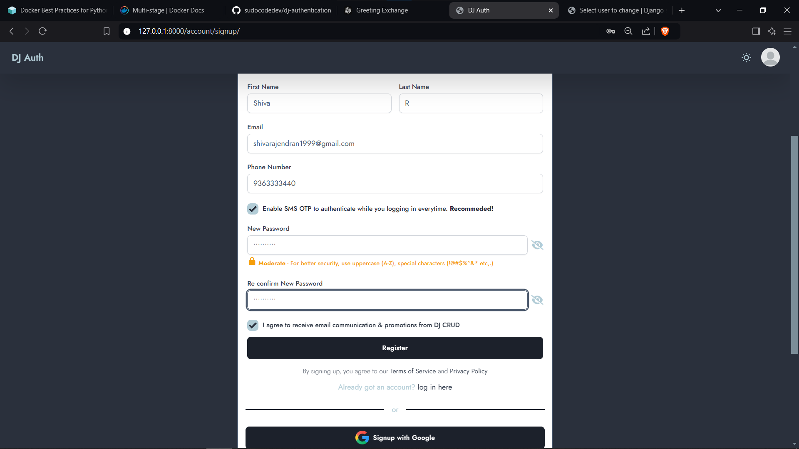
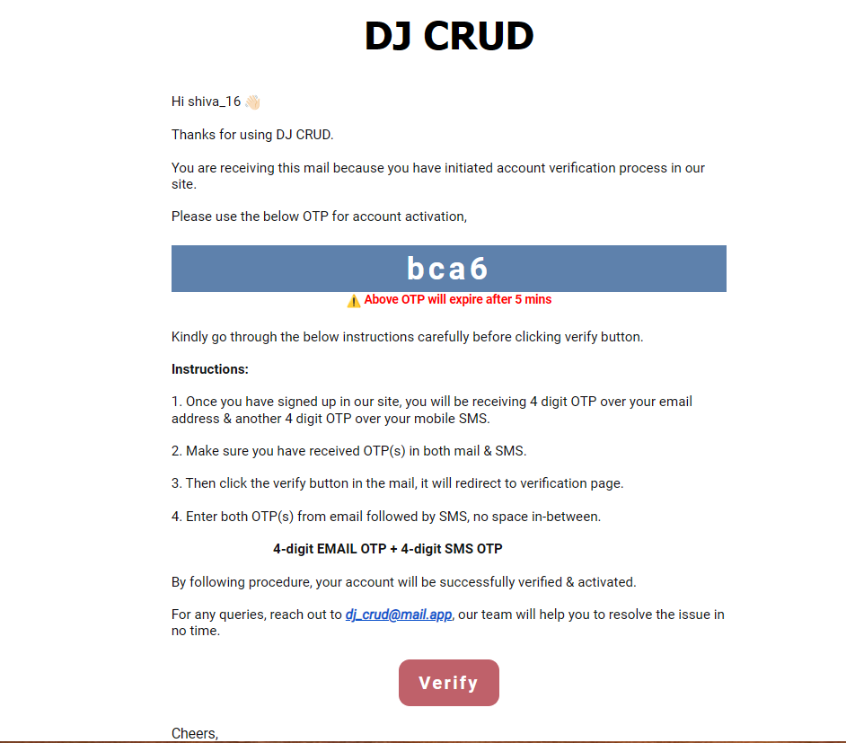
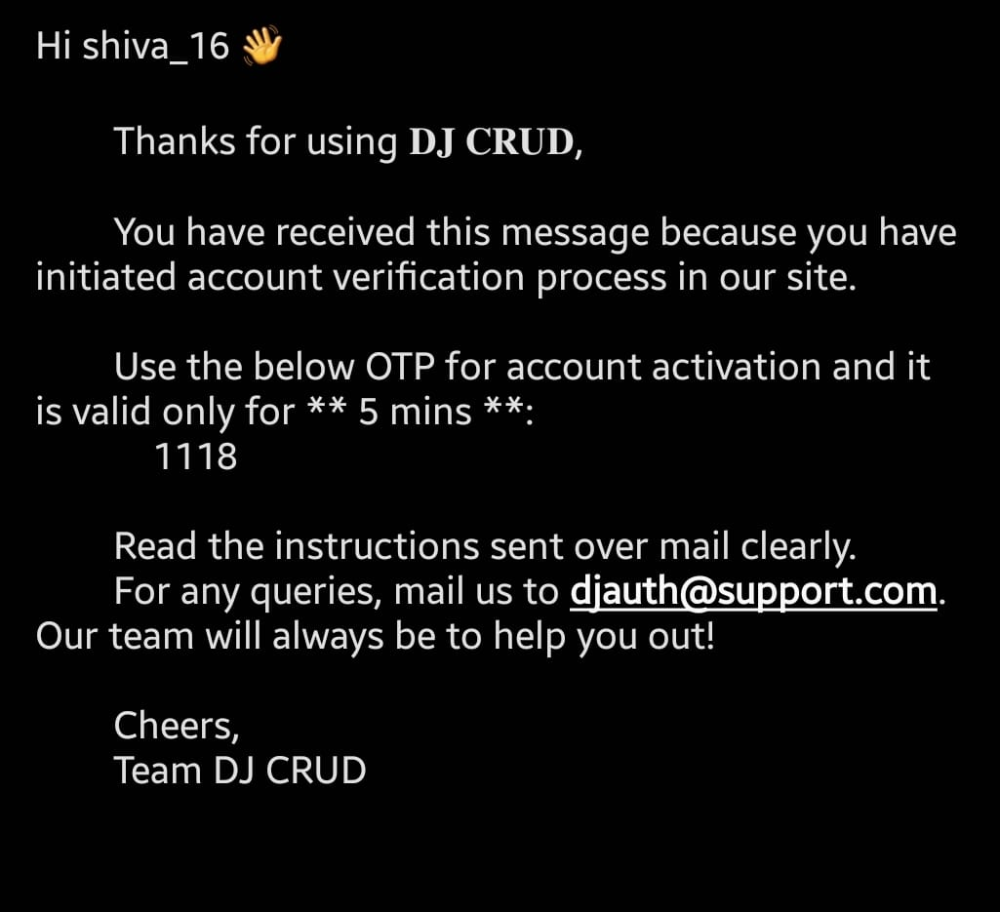
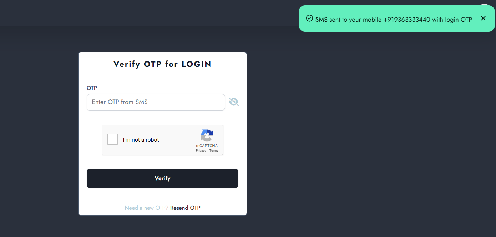
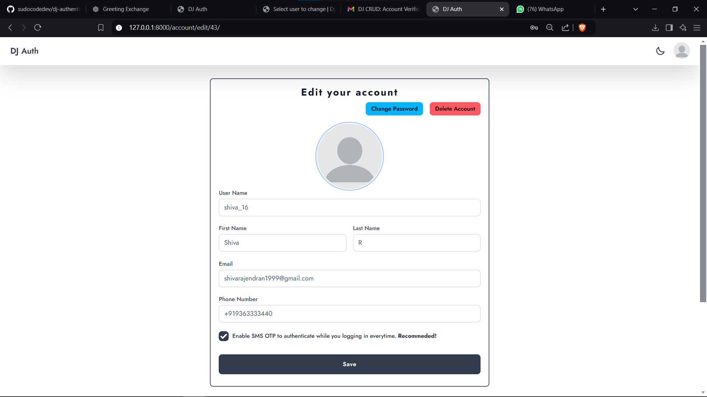

# DJ Auth
### (Django Authentication System with Two-Factor Authentication and Social Login)

A comprehensive Django-based authentication system that enhances security with features such as email and SMS-based OTP verification, two-factor authentication (2FA), password strength validation, social login (Google, GitHub), and Google reCAPTCHA.

## 🚀 Features

- **Account Creation with Validation**: Users can register by providing their email, phone number, username, and profile image. Real-time form validation includes detailed error messages and password strength checks.

- **Two-Step Account Verification**:
  - An 8-digit alphanumeric OTP is generated upon account creation.
  - First 4 digits are sent via email, and the remaining 4 digits are sent via SMS (using SMS Chef API), ensuring secure verification.
  - Users must enter the combined OTP to complete the verification process.

- **Profile Management**:
  - Users can view, update, or delete their profiles.
  - Optional 6-digit SMS-based two-factor authentication (2FA) for an additional security layer.

- **Social Authentication**:
  - Users can sign up and log in using their Google or GitHub accounts.

- **Password Reset with Google reCAPTCHA**:
  - Forgot your password? Easily reset it with email verification and Google reCAPTCHA to ensure secure form submissions.

- **Threaded OTP Dispatch**:
  - OTP emails and SMS messages are sent in parallel using threading to improve performance and user experience.

## 🛠️ Technologies Used

- **Backend**: Django, SQLite
- **Frontend**: Javascript, TailwindCSS, DaisyUI
- **SMS API**: SMS Chef API for sending OTPs via SMS
- **Security**: Google reCAPTCHA for form submissions and password resets
- **Version Control**: Git

## ⚙️ How It Works

1. **User Registration**:
   - User submits registration form with details (email, phone, username, profile image).
   - Backend validates input and displays error messages if any.
   - Upon successful submission, an 8-digit OTP is generated.
   - OTP is split into two parts: the first half is sent via email, and the second half is sent via SMS.

2. **Account Verification**:
   - Users receive a link via email for account verification.
   - Upon visiting the link, users are asked to enter the combined OTP (from email and SMS) to verify their account.

3. **Profile Management**:
   - Once logged in, users can update or delete their profile information.
   - Users can enable 2FA, which prompts them to enter a 6-digit OTP (via SMS) for each login attempt.

4. **Social Login**:
   - Users can sign up or log in using their Google or GitHub credentials.

5. **Password Reset**:
   - If users forget their password, they can request a password reset via email.
   - A reset link is sent to their email, and they must verify a Google reCAPTCHA before resetting the password.

## 📦 Setup Instructions

**(Running via docker compose)**
### 1. Clone the Repository
```bash
git clone https://github.com/sudocodedev/dj-authentication.git
cd dj-authentication
```

### 2. Run docker compose command
```bash
docker compose up --build
```

### 3. Access the App
Open your browser and visit `http://127.0.0.1:9001/` to explore the authentication system.

---
**(Installing locally)**
### 1. Clone the Repository
```bash
git clone https://github.com/sudocodedev/dj-authentication.git
cd dj-authentication
```

### 2. Install Dependencies
Make sure you have Python installed. Then, run:
```bash
pip install -r requirements.txt
```

### 3. Configure Environment Variables
Set up the following environment variables in your `.env` file:

```
# Django
SECRET_KEY=your_django_secret_key
DEBUG=(set either 1 or 0)

# API
SMS_CHEF_API_KEY=your_sms_chef_api_key
SMS_CHEF_DEVICE_ID=your_sms_chef_device_id
SMS_CHEF_URL=https://www.cloud.smschef.com/api/send/sms


# Project
OTP_EXPIRY_TIME=5

# Email settings
HOST=smtp.gmail.com
HOST_USER=your_gmail_id
HOST_PASSWORD=your_gmail_secret_key

# ReCaptcha
CAPTCHA_SITE_KEY=your_captcha_site_key
CAPTCHA_SECRET_KEY=your_captcha_secret_key

# social auth
GOOGLE_KEY=your_google_site_key
GOOGLE_SECRET=your_google_secret_key
GITHUB_KEY=your_github_site_key
GITHUB_SECRET=your_github_secret_key
```

### 4. Run Migrations
```bash
python manage.py migrate
```

### 5. Create a Superuser
```bash
python manage.py createsuperuser
```

### 6. Run the Development Server
```bash
python manage.py runserver
```

### 7. Access the App
Open your browser and visit `http://127.0.0.1:8000/` to explore the authentication system.

## 🔒 Security Features

- **Two-Factor Authentication (2FA)** via SMS
- **Google reCAPTCHA** for password reset and form security
- **Threading** to send OTPs concurrently via email and SMS
- **Password Strength Validation** to encourage strong passwords

## 🖼️ Screenshots


*Signup form with real-time validation.*


*OTP verification page after signup.*


*OTP verification page after signup.*


*2FA after signin.*


*Profile management with 2FA option.*
